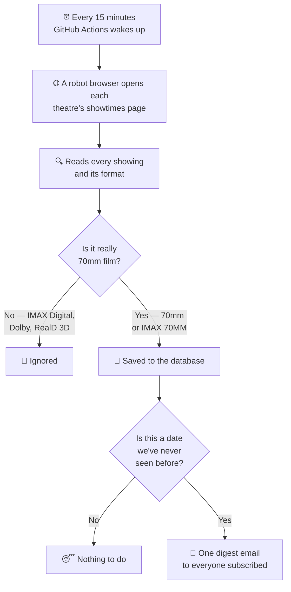

# IMAX 70mm Tracker

**Get an email the moment a real IMAX 70mm film print goes on sale at your theatre — usually within 15 minutes of the tickets appearing.**

---

## The problem this solves

When a movie like Christopher Nolan's *The Odyssey* is shown on genuine 70mm film, only a handful of theatres in the world can project it, and those showings sell out fast — often within hours of going on sale.

There's no announcement. Theatres don't email you. Tickets simply appear on the website one day, quietly, and the best seats are gone before most people notice.

This app watches those theatres for you, around the clock, and emails you the instant a 70mm showing appears.

## What you actually experience

1. **You sign in** with your Google account at the site's home page. No password to create.
2. **You pick which movies to track** on your dashboard — a simple on/off toggle per movie.
3. **You go about your life.** The app checks the theatres every 15 minutes, day and night.
4. **You get an email** the moment new 70mm dates go on sale, listing every new showtime with a direct link to buy tickets.

That's the whole product. There's nothing to install and nothing to check manually.

### Your dashboard

Once signed in, your dashboard shows three things:

- **Movies** — every movie being tracked, with a toggle to subscribe. Under each one you'll see *"70mm on sale through Aug 14, 2026"*, which tells you how far into the future tickets currently exist. That's the edge of the booking window, and watching it move is how you know new dates are being released.
- **Theatres tracked** — the six cinemas being watched.
- **Upcoming 70mm showtimes** — every future 70mm screening found so far, grouped by theatre, with ticket links.

### The emails

You get **one email per check**, never one per showtime — so a theatre releasing thirty showtimes at once produces a single message, not thirty.

- If one movie dropped at one theatre: *"70mm print threaded — The Odyssey · AMC Metreon 16 & IMAX"*
- If several dropped at once: *"3 new 70mm drops"*

Each email lists the new dates and links straight to the theatre's ticket page. **You are never emailed about the same date twice** — once a date has been reported to you, it's marked as sent and permanently skipped.

## Theatres being watched

| # | Theatre | City | Status |
|---|---|---|---|
| 1 | AMC Metreon 16 & IMAX | San Francisco, CA | ✅ **Live** |
| 2 | Regal Hacienda Crossings & IMAX | Dublin, CA | ⏸️ Paused |
| 3 | Universal Cinema AMC at CityWalk Hollywood & IMAX | Universal City, CA | ✅ **Live** |
| 4 | Regal Irvine Spectrum & IMAX | Irvine, CA | ⏸️ Paused |
| 5 | Regal LA Live & IMAX | Los Angeles, CA | ⏸️ Paused |
| 6 | Regal Edwards Ontario Palace & IMAX | Ontario, CA | ⏸️ Paused |

The two AMC theatres are fully working. **The four Regal theatres are currently paused** — see [Why Regal is paused](#why-regal-is-paused) below.

---

## How it works, in plain English



### 1. A robot browser does the looking

Both AMC and Regal block automated access to their data feeds, so the app can't simply ask them for a list of showtimes. Instead it runs a **real web browser with no window** (a "headless browser") that loads the theatre's public showtimes page exactly the way your laptop would, then reads what's on the screen.

This runs on GitHub's free servers on a schedule — every 15 minutes, forever, at no cost.

### 2. It only walks as far forward as it needs to

Theatres sell tickets for a rolling window into the future — maybe ten days out, maybe thirty. New dates get added to the far edge of that window, and **that edge is exactly where a new 70mm drop shows up first**.

Rather than re-checking a fixed two weeks of dates every single run (which meant loading 14 pages per theatre and broke often), the app remembers where the booking window ended last time and walks forward from there, one day at a time, stopping one day after it finds an empty date.

In practice that's **1–3 page loads per theatre instead of 14** — far faster, far less likely to be rate-limited, and it still notices the moment the window extends. If it hits a single empty day with more showtimes after it, it keeps going rather than stopping early, and it never looks more than 60 days ahead.

### 3. Telling real 70mm from marketing fluff

This is the part that matters most, because getting it wrong means either false alarms or missed drops.

Cinemas use the word "IMAX" for several very different things. **IMAX Digital is not 70mm film** — it's a digital projection, and it is not what enthusiasts are waiting for. The app therefore checks the *format label* attached to each individual showing:

| Format label | Treated as 70mm? |
|---|---|
| `IMAX 70MM` | ✅ Yes |
| `70mm` | ✅ Yes |
| `70 mm` | ✅ Yes |
| `IMAX at AMC` | ❌ No — digital |
| `Dolby Cinema at AMC` | ❌ No |
| `RealD 3D` | ❌ No |

A movie is only matched when the format is genuinely 70mm, so standard-format showings of the same film are correctly ignored. This rule is locked down by automated tests (see [Tests](#tests)) precisely because a mistake here would defeat the app's entire purpose.

### 4. Deciding what counts as "new"

The app records a **drop** for each new combination of *movie + theatre + date*. Because the date is part of that record, the app understands the difference between:

- *"The Odyssey is now playing at Metreon"* (interesting the first time), and
- *"The Odyssey now has tickets for August 14th too"* (interesting **every** time a new day opens up)

Each drop carries a marker for whether you've been told about it. After the emails go out, every drop processed in that run is stamped as notified — so even if something fails halfway, you'll never get a duplicate and never silently miss one.

### 5. Who gets emailed

You can subscribe to a movie **at all theatres** or **at one specific theatre**. When drops are found, the app groups them per person: it gathers only the drops matching that person's subscriptions, collapses multiple dates for the same movie and theatre into a single tidy entry, sorts the dates, and sends one email. If none of a run's drops match your subscriptions, you get no email at all.

---

## Why Regal is paused

Regal's website sits behind **Cloudflare bot protection**, which blocks traffic coming from data-centre IP addresses — and GitHub's servers are data-centre IPs. In testing, the scraper cleared the challenge **0 times out of 4** even with retries.

The same scraper works perfectly from a home internet connection, because residential IPs aren't treated as suspicious. So the code for all four Regal theatres is written, tested and ready — the only blocker is *where the request comes from*.

Two ways to switch Regal on, both documented in [SETUP.md](./SETUP.md):

- **A residential proxy** (~$5–15/month) routing Regal requests through a home-grade IP, keeping everything else on GitHub's free servers.
- **A home PC** running the Regal half of the scraper on your own connection. The app includes a health-monitor for this: if that machine stops reporting in for 45 minutes, or reports that it's being blocked, you get an alert email — and another when it recovers.

AMC has no such restriction and works fine from GitHub's servers.

---

## Tests

The project has **19 automated tests** that run on every change. They cover the pure logic — no database or network required:

| Area | What's verified |
|---|---|
| **70mm detection** | Real 70mm labels are accepted; IMAX Digital, Dolby and RealD 3D are rejected |
| **Booking-window walker** | Cold starts, stopping one day past the first empty date, filling single-day gaps, never looking before today, and the 60-day cap |
| **Email grouping** | All-theatre vs. single-theatre subscriptions, collapsing multiple dates into one entry, and never emailing someone with no matching drops |
| **Date handling** | Converting times to calendar dates, plus de-duplicating and sorting |

Run them yourself:

```bash
npm test        # the 19 tests
npm run typecheck   # type safety check
```

Every pull request automatically runs these tests, a type check, and a separate type check of the scraper, via `.github/workflows/test.yml`.

> **Worth knowing:** these tests deliberately don't touch the database. They verify decision-making logic, not the connection between the app and Postgres — so a database problem (see below) won't be caught by them.

---

## Troubleshooting

### "Application error: a server-side exception has occurred" after signing in

Almost always a **database schema mismatch**: the code expects a column that the live database doesn't have yet. The home page works (it doesn't read those tables) but the dashboard fails instantly (it does).

The database structure isn't updated automatically on deploy — it has to be pushed. With your production `DATABASE_URL` set:

```bash
npx prisma db push --accept-data-loss
```

`--accept-data-loss` is needed when a newly-required column is added to a table that already has rows. It clears old drop records, which the scraper simply regenerates on its next run.

To see the underlying error, open your Vercel project → **Logs**, then reload the failing page. A message like `The column Theatre.horizonDate does not exist in the current database` confirms this diagnosis.

### No emails arriving

Check, in order:
1. Is the movie toggled **on** in your dashboard?
2. Are `GMAIL_USER` and `GMAIL_APP_PASSWORD` set? Without them the app logs a warning and skips sending rather than crashing.
3. Has the scraper actually run? GitHub repo → **Actions** tab → *Scrape showtimes*.
4. Have the dates already been reported? Each date is only ever emailed once.

### The scraper finds nothing

Scheduled runs only fire from the repository's **default branch**, and `APP_URL` and `CRON_SECRET` must be set as **GitHub repository secrets** as well as in the app's environment.

---

## Running it yourself

Full step-by-step instructions — accounts, keys, deployment, scheduling — are in **[SETUP.md](./SETUP.md)**.

```bash
npm install
cp .env.example .env    # fill in the values, per SETUP.md
npm run db:push         # create the database tables
npm run db:seed         # add the six theatres and The Odyssey
npm run dev             # http://localhost:3000
```

### Adding more movies

Signed-in users can add movies at `/movies`, with a search bar powered by TMDB (needs `TMDB_API_KEY`; without it the search is disabled). Leave `ADMIN_EMAILS` blank and any signed-in user may add movies — convenient while you're the only user. Set it to a comma-separated list of email addresses to lock this down once other people can sign in.

---

## What it's built with

| Piece | Technology |
|---|---|
| Website | Next.js 14 (App Router) on Vercel |
| Database | Postgres (Neon) via Prisma |
| Sign-in | Auth.js with Google |
| Email | Gmail SMTP via Nodemailer |
| Scraper | Playwright headless browser on GitHub Actions |
| Tests | Vitest |

Everything runs on free tiers.

### Project map

| Path | What lives there |
|---|---|
| `app/` | Web pages and API endpoints |
| `lib/pipeline.ts` | Saving showtimes, detecting drops, sending digests |
| `lib/digest.ts` | Grouping drops into per-person emails |
| `lib/email.ts` | Email designs and delivery |
| `scraper/` | The headless-browser scraper and booking-window walker |
| `prisma/schema.prisma` | Database structure |
| `test/` | The automated tests |
| `design/notifications.html` | Visual design lab for the emails |

---

## Environment variables

All values live in `.env` (see `.env.example`). The scheduled scraper additionally needs `APP_URL` and `CRON_SECRET` set as GitHub Actions repository secrets. Full instructions for obtaining each are in [SETUP.md](./SETUP.md).

| Variable | Required | Purpose |
|---|---|---|
| `DATABASE_URL` | yes | Postgres connection string (Neon, Supabase, local) |
| `AUTH_SECRET` | yes | Auth.js session/token encryption secret |
| `AUTH_GOOGLE_ID` | yes | Google OAuth client ID (sign-in) |
| `AUTH_GOOGLE_SECRET` | yes | Google OAuth client secret (sign-in) |
| `AUTH_URL` | yes | Canonical URL Auth.js uses for OAuth callbacks |
| `GMAIL_USER` | yes | Gmail address used as the SMTP sender |
| `GMAIL_APP_PASSWORD` | yes | Google App Password (2-Step Verification required) for Gmail SMTP |
| `EMAIL_FROM` | yes | "From" address for outgoing emails (Gmail forces the address to `GMAIL_USER`; display name is free) |
| `CRON_SECRET` | yes | Shared secret authenticating `/api/cron/poll`, `/api/ingest`, and `/api/scrape-config`; also set as a GitHub Actions repo secret |
| `APP_URL` | yes | Public base URL of the deployed app; used in email links and by the scraper to reach the API; also set as a GitHub Actions repo secret |
| `AMC_VENDOR_KEY` | no | AMC official API vendor key (`X-AMC-Vendor-Key`); unused by the current headless-scraper pipeline, kept for the legacy/direct-API adapter |
| `ADMIN_EMAILS` | no | Comma-separated emails allowed to add movies at `/movies`; leave blank for single-user mode |
| `TMDB_API_KEY` | no | [TMDB](https://www.themoviedb.org/settings/api) v3 API key powering the movie search bar at `/movies`; without it the search bar is disabled |
| `DRY_RUN` | no | Set to `true`/`1`/`yes` when running `scraper/scrape.ts` locally to log findings without posting to `/api/ingest` |
| `SCRAPE_CHAINS` | no | Which chains a scraper run handles (`AMC`, `REGAL`, or both comma-separated). Defaults to `AMC` |
| `ALERT_EMAIL` | no | Where Regal-scraper offline/blocked/recovery alerts are sent; falls back to the first `ADMIN_EMAILS` entry, then `GMAIL_USER` |
| `HEARTBEAT_STALE_MINUTES` | no | Minutes without a Regal heartbeat before the home PC is considered offline (default 45) |
